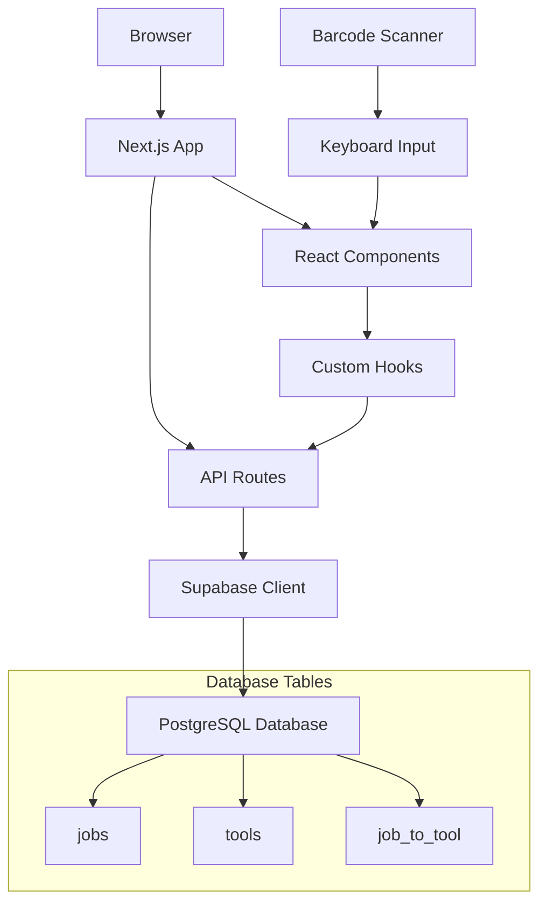
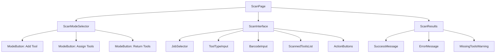
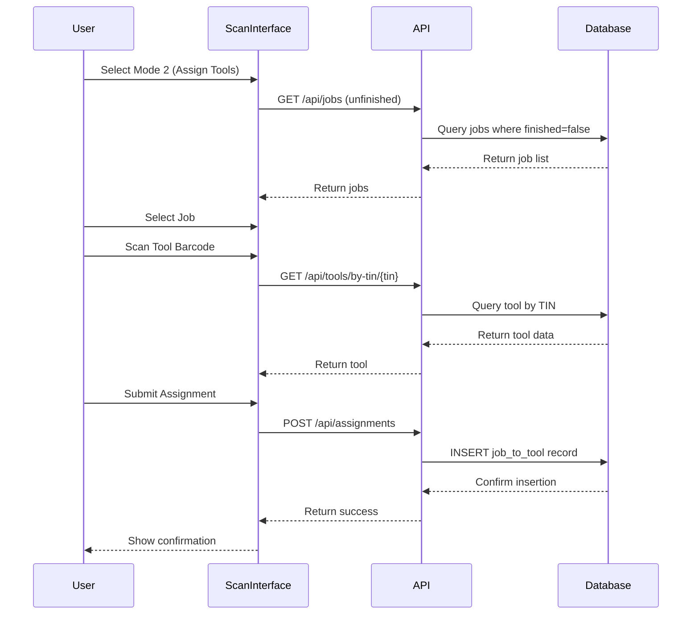

# Tool Tracker Architecture Design

## 1. TypeScript Data Models & Interfaces

### Core Database Models

```typescript
// Database table interfaces
export interface Job {
  jobId: string; // Primary key (UUID)
  company: string;
  startDate: string; // ISO date string
  endDate: string | null; // ISO date string, null if ongoing
  finished: boolean;
  createdAt: string; // ISO timestamp
  updatedAt: string; // ISO timestamp
}

export interface Tool {
  toolId: string; // Primary key (UUID)
  tin: string; // Tool identification number (barcode)
  toolType: string; // Flexible string type for tool categories
  dateAdded: string; // ISO date string
  createdAt: string; // ISO timestamp
  updatedAt: string; // ISO timestamp
}

export interface JobToTool {
  id: string; // Primary key (UUID)
  jobId: string; // Foreign key to Job
  toolId: string; // Foreign key to Tool
  assignedAt: string; // ISO timestamp when tool was assigned
  returnedAt: string | null; // ISO timestamp when returned, null if still assigned
  createdAt: string; // ISO timestamp
}
```

### Extended Models with Relations

```typescript
// Extended models for API responses
export interface JobWithTools extends Job {
  tools: ToolAssignment[];
  toolCount: number;
  returnedToolCount: number;
  missingToolCount: number;
}

export interface ToolWithJobs extends Tool {
  currentJob: Job | null;
  jobHistory: JobAssignment[];
  isCurrentlyAssigned: boolean;
}

export interface ToolAssignment {
  id: string;
  tool: Tool;
  job: Job;
  assignedAt: string;
  returnedAt: string | null;
  isReturned: boolean;
}

export interface JobAssignment {
  id: string;
  job: Job;
  tool: Tool;
  assignedAt: string;
  returnedAt: string | null;
  isReturned: boolean;
}
```

### API Request/Response Types

```typescript
// API Request types
export interface CreateJobRequest {
  company: string;
  startDate: string;
  endDate?: string;
}

export interface UpdateJobRequest {
  company?: string;
  startDate?: string;
  endDate?: string;
  finished?: boolean;
}

export interface CreateToolRequest {
  tin: string;
  toolType: string;
}

export interface AssignToolsRequest {
  jobId: string;
  toolIds: string[];
}

export interface ReturnToolsRequest {
  jobId: string;
  toolIds: string[];
}

// API Response types
export interface ApiResponse<T = any> {
  success: boolean;
  data?: T;
  error?: string;
  message?: string;
}

export interface PaginatedResponse<T> extends ApiResponse<T[]> {
  pagination: {
    page: number;
    limit: number;
    total: number;
    totalPages: number;
  };
}
```

### Scanning Mode Types

```typescript
export enum ScanningMode {
  ADD_TOOL = 'add_tool',
  ASSIGN_TOOLS = 'assign_tools',
  RETURN_TOOLS = 'return_tools'
}

export interface ScanningState {
  mode: ScanningMode;
  selectedJob: Job | null;
  scannedTools: Tool[];
  isScanning: boolean;
  error: string | null;
}

export interface ScanResult {
  success: boolean;
  tool?: Tool;
  error?: string;
  isDuplicate?: boolean;
}
```

## 2. API Endpoint Structure

### Base API Configuration
- Base URL: `/api`
- All endpoints return JSON with consistent `ApiResponse<T>` format
- Error handling with appropriate HTTP status codes

### Job Endpoints

```typescript
// GET /api/jobs - Get all jobs with optional filtering
interface GetJobsParams {
  finished?: boolean;
  company?: string;
  startDate?: string;
  endDate?: string;
  page?: number;
  limit?: number;
}

// GET /api/jobs/[jobId] - Get job by ID with tools
// POST /api/jobs - Create new job
// PUT /api/jobs/[jobId] - Update job
// DELETE /api/jobs/[jobId] - Delete job (soft delete if has tools)

// GET /api/jobs/[jobId]/tools - Get all tools for a job
// GET /api/jobs/[jobId]/missing-tools - Get missing tools for a job
```

### Tool Endpoints

```typescript
// GET /api/tools - Get all tools with optional filtering
interface GetToolsParams {
  toolType?: string;
  isAssigned?: boolean;
  jobId?: string;
  tin?: string; // Search by barcode
  page?: number;
  limit?: number;
}

// GET /api/tools/[toolId] - Get tool by ID with job history
// POST /api/tools - Create new tool
// PUT /api/tools/[toolId] - Update tool
// DELETE /api/tools/[toolId] - Delete tool (only if never assigned)

// GET /api/tools/by-tin/[tin] - Get tool by barcode/TIN
// GET /api/tools/available - Get all unassigned tools
```

### Tool Assignment Endpoints

```typescript
// POST /api/assignments - Assign tools to job
// PUT /api/assignments/return - Return tools from job
// GET /api/assignments - Get all assignments with filtering
// DELETE /api/assignments/[assignmentId] - Remove assignment (admin only)
```

### Search/Query Endpoints

```typescript
// GET /api/queries/tools-by-job/[jobId] - All tools for specific job
// GET /api/queries/missing-tools - All currently missing tools
// GET /api/queries/job-history/[toolId] - Job history for specific tool
// GET /api/queries/tool-usage-stats - Tool usage statistics
// GET /api/queries/company-tools/[company] - All tools currently with company
// GET /api/queries/overdue-returns - Tools not returned after job end date
```

## 3. Component Architecture for Scanning Page

### Main Scanning Container

```typescript
// /src/app/scan/page.tsx
interface ScanPageProps {}

export default function ScanPage() {
  // Main scanning page with mode selection and scanning interface
}
```

### Component Hierarchy

```
ScanPage
├── ScanModeSelector
│   ├── ModeButton (Add Tool)
│   ├── ModeButton (Assign Tools)
│   └── ModeButton (Return Tools)
├── ScanInterface
│   ├── JobSelector (Mode 2 & 3 only)
│   ├── ToolTypeInput (Mode 1 only)
│   ├── BarcodeInput
│   ├── ScannedToolsList
│   └── ActionButtons
└── ScanResults
    ├── SuccessMessage
    ├── ErrorMessage
    └── MissingToolsWarning (Mode 3 only)
```

### Individual Component Interfaces

```typescript
// Scan Mode Selector
interface ScanModeSelectorProps {
  currentMode: ScanningMode;
  onModeChange: (mode: ScanningMode) => void;
}

// Job Selector (for modes 2 & 3)
interface JobSelectorProps {
  selectedJob: Job | null;
  onJobSelect: (job: Job) => void;
  jobs: Job[];
  loading: boolean;
}

// Barcode Input
interface BarcodeInputProps {
  onScan: (barcode: string) => void;
  disabled: boolean;
  placeholder?: string;
}

// Tool Type Input (for mode 1)
interface ToolTypeInputProps {
  value: string;
  onChange: (toolType: string) => void;
  suggestions: string[];
}

// Scanned Tools List
interface ScannedToolsListProps {
  tools: Tool[];
  onRemoveTool: (toolId: string) => void;
  mode: ScanningMode;
}

// Action Buttons
interface ActionButtonsProps {
  mode: ScanningMode;
  onSubmit: () => void;
  onClear: () => void;
  disabled: boolean;
  toolCount: number;
}

// Missing Tools Warning (mode 3)
interface MissingToolsWarningProps {
  missingTools: Tool[];
  onAcknowledge: () => void;
}
```

## 4. Query Structure for Search Page

### Search Page Component Architecture

```
SearchPage
├── QuerySelector
│   ├── PresetQueries
│   └── CustomQueryBuilder
├── QueryResults
│   ├── ResultsTable
│   ├── ExportButton
│   └── Pagination
└── QueryFilters
    ├── DateRangePicker
    ├── CompanyFilter
    └── ToolTypeFilter
```

### Preset Queries Configuration

```typescript
interface PresetQuery {
  id: string;
  name: string;
  description: string;
  endpoint: string;
  params?: Record<string, any>;
  resultType: 'tools' | 'jobs' | 'assignments';
}

export const PRESET_QUERIES: PresetQuery[] = [
  {
    id: 'missing-tools',
    name: 'Missing Tools',
    description: 'All tools currently not returned from jobs',
    endpoint: '/api/queries/missing-tools',
    resultType: 'tools'
  },
  {
    id: 'active-jobs',
    name: 'Active Jobs',
    description: 'All jobs currently in progress',
    endpoint: '/api/jobs',
    params: { finished: false },
    resultType: 'jobs'
  },
  {
    id: 'tool-usage',
    name: 'Tool Usage Stats',
    description: 'Statistics on tool usage and assignments',
    endpoint: '/api/queries/tool-usage-stats',
    resultType: 'assignments'
  },
  {
    id: 'overdue-returns',
    name: 'Overdue Returns',
    description: 'Tools not returned after job end date',
    endpoint: '/api/queries/overdue-returns',
    resultType: 'tools'
  }
];
```

### Query Result Types

```typescript
interface QueryResult {
  id: string;
  query: PresetQuery;
  data: any[];
  executedAt: string;
  totalRows: number;
  executionTime: number;
}

interface QueryFilter {
  field: string;
  operator: 'equals' | 'contains' | 'gt' | 'lt' | 'between';
  value: any;
}
```

## 5. Application Routing Structure

### Route Configuration

```
/
├── / (Home/Dashboard)
├── /scan (Scanning Interface)
├── /search (Search/Query Interface)
├── /jobs
│   ├── /jobs (List all jobs)
│   ├── /jobs/[jobId] (Job details)
│   └── /jobs/new (Create new job)
├── /tools
│   ├── /tools (List all tools)
│   ├── /tools/[toolId] (Tool details)
│   └── /tools/new (Add new tool)
└── /api
    ├── /api/jobs/...
    ├── /api/tools/...
    ├── /api/assignments/...
    └── /api/queries/...
```

### Page Components Structure

```typescript
// Route definitions with their purposes
interface RouteDefinition {
  path: string;
  component: string;
  purpose: string;
  access: 'public' | 'protected';
}

export const ROUTES: RouteDefinition[] = [
  {
    path: '/',
    component: 'HomePage',
    purpose: 'Dashboard with quick stats and navigation',
    access: 'public'
  },
  {
    path: '/scan',
    component: 'ScanPage',
    purpose: 'Main scanning interface for all 3 modes',
    access: 'public'
  },
  {
    path: '/search',
    component: 'SearchPage',
    purpose: 'Query interface with preset and custom queries',
    access: 'public'
  },
  {
    path: '/jobs',
    component: 'JobsListPage',
    purpose: 'List and manage all jobs',
    access: 'public'
  },
  {
    path: '/jobs/[jobId]',
    component: 'JobDetailPage',
    purpose: 'View job details, assigned tools, and history',
    access: 'public'
  },
  {
    path: '/tools',
    component: 'ToolsListPage',
    purpose: 'List and manage all tools',
    access: 'public'
  },
  {
    path: '/tools/[toolId]',
    component: 'ToolDetailPage',
    purpose: 'View tool details and assignment history',
    access: 'public'
  }
];
```

## 6. Database Schema SQL Definitions

### Supabase SQL Schema

```sql
-- Enable UUID extension
CREATE EXTENSION IF NOT EXISTS "uuid-ossp";

-- Jobs table
CREATE TABLE jobs (
    job_id UUID PRIMARY KEY DEFAULT uuid_generate_v4(),
    company VARCHAR(255) NOT NULL,
    start_date DATE NOT NULL,
    end_date DATE,
    finished BOOLEAN DEFAULT FALSE,
    created_at TIMESTAMP WITH TIME ZONE DEFAULT NOW(),
    updated_at TIMESTAMP WITH TIME ZONE DEFAULT NOW()
);

-- Tools table
CREATE TABLE tools (
    tool_id UUID PRIMARY KEY DEFAULT uuid_generate_v4(),
    tin VARCHAR(255) UNIQUE NOT NULL, -- Tool identification number (barcode)
    tool_type VARCHAR(255) NOT NULL,
    date_added DATE NOT NULL DEFAULT CURRENT_DATE,
    created_at TIMESTAMP WITH TIME ZONE DEFAULT NOW(),
    updated_at TIMESTAMP WITH TIME ZONE DEFAULT NOW()
);

-- Job to Tool assignment junction table
CREATE TABLE job_to_tool (
    id UUID PRIMARY KEY DEFAULT uuid_generate_v4(),
    job_id UUID NOT NULL REFERENCES jobs(job_id) ON DELETE CASCADE,
    tool_id UUID NOT NULL REFERENCES tools(tool_id) ON DELETE CASCADE,
    assigned_at TIMESTAMP WITH TIME ZONE DEFAULT NOW(),
    returned_at TIMESTAMP WITH TIME ZONE,
    created_at TIMESTAMP WITH TIME ZONE DEFAULT NOW()
);

-- Indexes for performance
CREATE INDEX idx_job_to_tool_job_id ON job_to_tool(job_id);
CREATE INDEX idx_job_to_tool_tool_id ON job_to_tool(tool_id);
CREATE INDEX idx_job_to_tool_returned_at ON job_to_tool(returned_at);
CREATE INDEX idx_tools_tin ON tools(tin);
CREATE INDEX idx_jobs_company ON jobs(company);
CREATE INDEX idx_jobs_finished ON jobs(finished);

-- Updated at triggers
CREATE OR REPLACE FUNCTION update_updated_at_column()
RETURNS TRIGGER AS $$
BEGIN
    NEW.updated_at = NOW();
    RETURN NEW;
END;
$$ language 'plpgsql';

CREATE TRIGGER update_jobs_updated_at 
    BEFORE UPDATE ON jobs 
    FOR EACH ROW 
    EXECUTE FUNCTION update_updated_at_column();

CREATE TRIGGER update_tools_updated_at 
    BEFORE UPDATE ON tools 
    FOR EACH ROW 
    EXECUTE FUNCTION update_updated_at_column();
```

### Useful Database Views

```sql
-- View for currently assigned tools
CREATE VIEW currently_assigned_tools AS
SELECT 
    t.tool_id,
    t.tin,
    t.tool_type,
    j.job_id,
    j.company,
    jtt.assigned_at
FROM tools t
JOIN job_to_tool jtt ON t.tool_id = jtt.tool_id
JOIN jobs j ON jtt.job_id = j.job_id
WHERE jtt.returned_at IS NULL;

-- View for missing tools (assigned to finished jobs but not returned)
CREATE VIEW missing_tools AS
SELECT 
    t.tool_id,
    t.tin,
    t.tool_type,
    j.job_
id,
    j.company,
    j.end_date,
    jtt.assigned_at,
    CURRENT_DATE - j.end_date AS days_overdue
FROM tools t
JOIN job_to_tool jtt ON t.tool_id = jtt.tool_id
JOIN jobs j ON jtt.job_id = j.job_id
WHERE jtt.returned_at IS NULL 
AND j.finished = TRUE;

-- View for available tools
CREATE VIEW available_tools AS
SELECT 
    t.tool_id,
    t.tin,
    t.tool_type,
    t.date_added
FROM tools t
LEFT JOIN job_to_tool jtt ON t.tool_id = jtt.tool_id AND jtt.returned_at IS NULL
WHERE jtt.tool_id IS NULL;
```

## 7. State Management Approach

### React State Management Strategy

For this minimal application, we'll use a combination of:
- **React's built-in state** for component-level state
- **Custom hooks** for shared logic and API calls
- **Context API** for global application state (minimal usage)
- **SWR/TanStack Query** for server state management (recommended for future enhancement)

### Custom Hooks Architecture

```typescript
// API hooks for data fetching and mutations
export const useJobs = (params?: GetJobsParams) => {
  // Fetch jobs with optional filtering
}

export const useJob = (jobId: string) => {
  // Fetch single job with tools
}

export const useTools = (params?: GetToolsParams) => {
  // Fetch tools with optional filtering
}

export const useTool = (toolId: string) => {
  // Fetch single tool with job history
}

export const useToolByTin = (tin: string) => {
  // Fetch tool by barcode
}

// Mutation hooks
export const useCreateJob = () => {
  // Create new job mutation
}

export const useCreateTool = () => {
  // Create new tool mutation
}

export const useAssignTools = () => {
  // Assign tools to job mutation
}

export const useReturnTools = () => {
  // Return tools from job mutation
}

// Scanning-specific hooks
export const useScanning = () => {
  // Manage scanning state and operations
}

export const useBarcodeInput = () => {
  // Handle barcode input with validation
}
```

### Global Context (Minimal)

```typescript
interface AppContextType {
  // Global loading states
  isLoading: boolean;
  
  // Global error handling
  error: string | null;
  setError: (error: string | null) => void;
  
  // Toast notifications
  showToast: (message: string, type: 'success' | 'error' | 'info') => void;
}

export const AppContext = createContext<AppContextType | undefined>(undefined);
export const useAppContext = () => {
  const context = useContext(AppContext);
  if (!context) {
    throw new Error('useAppContext must be used within AppProvider');
  }
  return context;
};
```

## 8. Reusable UI Components Architecture

### Base Component Library

```typescript
// Layout Components
interface LayoutProps {
  children: React.ReactNode;
  title?: string;
}

export const Layout = ({ children, title }: LayoutProps) => {
  // Main application layout with navigation
}

export const PageHeader = ({ title, actions }: PageHeaderProps) => {
  // Consistent page header with title and action buttons
}

// Form Components
interface InputProps extends React.InputHTMLAttributes<HTMLInputElement> {
  label?: string;
  error?: string;
  helperText?: string;
}

export const Input = ({ label, error, helperText, ...props }: InputProps) => {
  // Styled input with label and error handling
}

export const Select = ({ label, options, error, ...props }: SelectProps) => {
  // Styled select dropdown
}

export const Button = ({ variant, size, children, ...props }: ButtonProps) => {
  // Styled button with variants (primary, secondary, danger)
}

// Data Display Components
interface TableProps<T> {
  data: T[];
  columns: Column<T>[];
  loading?: boolean;
  onRowClick?: (row: T) => void;
}

export const Table = <T,>({ data, columns, loading, onRowClick }: TableProps<T>) => {
  // Generic table component with sorting and pagination
}

export const Card = ({ title, children, actions }: CardProps) => {
  // Consistent card layout for content sections
}

// Feedback Components
export const LoadingSpinner = ({ size }: LoadingSpinnerProps) => {
  // Loading spinner with different sizes
}

export const Toast = ({ message, type, onClose }: ToastProps) => {
  // Toast notification component
}

export const Modal = ({ isOpen, onClose, title, children }: ModalProps) => {
  // Modal dialog component
}

// Specialized Components
export const BarcodeInputField = ({ onScan, disabled }: BarcodeInputFieldProps) => {
  // Specialized input for barcode scanning
}

export const ToolCard = ({ tool, showActions }: ToolCardProps) => {
  // Display tool information in card format
}

export const JobStatusBadge = ({ status }: JobStatusBadgeProps) => {
  // Display job status with appropriate styling
}
```

### Component Styling with Tailwind CSS

```typescript
// Tailwind utility classes organized by component type
export const styles = {
  // Layout
  page: 'min-h-screen bg-gray-50 p-4',
  container: 'max-w-7xl mx-auto',
  
  // Cards
  card: 'bg-white rounded-lg shadow-sm border border-gray-200 p-6',
  cardHeader: 'flex justify-between items-center mb-4',
  
  // Forms
  input: 'w-full px-3 py-2 border border-gray-300 rounded-md focus:outline-none focus:ring-2 focus:ring-blue-500',
  inputError: 'border-red-500 focus:ring-red-500',
  label: 'block text-sm font-medium text-gray-700 mb-1',
  
  // Buttons
  buttonPrimary: 'bg-blue-600 hover:bg-blue-700 text-white font-medium py-2 px-4 rounded-md transition-colors',
  buttonSecondary: 'bg-gray-200 hover:bg-gray-300 text-gray-800 font-medium py-2 px-4 rounded-md transition-colors',
  buttonDanger: 'bg-red-600 hover:bg-red-700 text-white font-medium py-2 px-4 rounded-md transition-colors',
  
  // Status indicators
  statusActive: 'inline-flex items-center px-2.5 py-0.5 rounded-full text-xs font-medium bg-green-100 text-green-800',
  statusInactive: 'inline-flex items-center px-2.5 py-0.5 rounded-full text-xs font-medium bg-gray-100 text-gray-800',
  statusWarning: 'inline-flex items-center px-2.5 py-0.5 rounded-full text-xs font-medium bg-yellow-100 text-yellow-800',
};
```

## 9. Error Handling and Validation Patterns

### API Error Handling

```typescript
// Standardized error types
export interface ApiError {
  code: string;
  message: string;
  details?: any;
  field?: string; // For validation errors
}

export class ToolTrackerError extends Error {
  code: string;
  details?: any;
  
  constructor(code: string, message: string, details?: any) {
    super(message);
    this.code = code;
    this.details = details;
    this.name = 'ToolTrackerError';
  }
}

// Error handling utilities
export const handleApiError = (error: any): ApiError => {
  if (error.response?.data?.error) {
    return error.response.data.error;
  }
  
  return {
    code: 'UNKNOWN_ERROR',
    message: error.message || 'An unexpected error occurred'
  };
};

// Error boundary component
export class ErrorBoundary extends React.Component<ErrorBoundaryProps, ErrorBoundaryState> {
  // React error boundary for catching rendering errors
}
```

### Validation Schemas

```typescript
// Validation using Zod (recommended) or similar library
import { z } from 'zod';

export const jobValidationSchema = z.object({
  company: z.string().min(1, 'Company name is required').max(255, 'Company name too long'),
  startDate: z.string().refine(date => !isNaN(Date.parse(date)), 'Invalid start date'),
  endDate: z.string().optional().refine(date => !date || !isNaN(Date.parse(date)), 'Invalid end date'),
});

export const toolValidationSchema = z.object({
  tin: z.string().min(1, 'Tool ID is required').max(255, 'Tool ID too long'),
  toolType: z.string().min(1, 'Tool type is required').max(255, 'Tool type too long'),
});

export const assignToolsValidationSchema = z.object({
  jobId: z.string().uuid('Invalid job ID'),
  toolIds: z.array(z.string().uuid('Invalid tool ID')).min(1, 'At least one tool must be selected'),
});

// Validation helpers
export const validateJobData = (data: any) => {
  try {
    return { success: true, data: jobValidationSchema.parse(data) };
  } catch (error) {
    return { success: false, errors: (error as z.ZodError).errors };
  }
};
```

### Client-Side Error Handling Patterns

```typescript
// Hook for managing form errors
export const useFormErrors = () => {
  const [errors, setErrors] = useState<Record<string, string>>({});
  
  const setFieldError = (field: string, message: string) => {
    setErrors(prev => ({ ...prev, [field]: message }));
  };
  
  const clearFieldError = (field: string) => {
    setErrors(prev => {
      const { [field]: removed, ...rest } = prev;
      return rest;
    });
  };
  
  const clearAllErrors = () => setErrors({});
  
  return { errors, setFieldError, clearFieldError, clearAllErrors };
};

// Hook for API call error handling
export const useApiCall = <T = any>() => {
  const [loading, setLoading] = useState(false);
  const [error, setError] = useState<string | null>(null);
  const { showToast } = useAppContext();
  
  const execute = async (apiCall: () => Promise<T>): Promise<T | null> => {
    try {
      setLoading(true);
      setError(null);
      const result = await apiCall();
      return result;
    } catch (err) {
      const apiError = handleApiError(err);
      setError(apiError.message);
      showToast(apiError.message, 'error');
      return null;
    } finally {
      setLoading(false);
    }
  };
  
  return { execute, loading, error };
};
```

## 10. Architecture Diagrams

### System Architecture Flow



### Component Hierarchy for Scanning Page



### Data Flow for Tool Assignment Process



## Implementation Priority

Based on the architecture design above, here's the recommended implementation order:

1. **Database Setup**: Create tables and views in Supabase
2. **Core Data Models**: Implement TypeScript interfaces and types
3. **Basic API Endpoints**: Jobs and Tools CRUD operations
4. **Core UI Components**: Layout, forms, and basic components
5. **Scanning Interface**: Implement the three scanning modes
6. **Assignment Logic**: Tool assignment and return functionality
7. **Search/Query Page**: Implement preset queries and results display
8. **Error Handling**: Add comprehensive error handling and validation
9. **Testing & Refinement**: Test all functionality and refine UX

This architecture provides a solid foundation for the minimal tool tracker demo while maintaining flexibility for future enhancements.